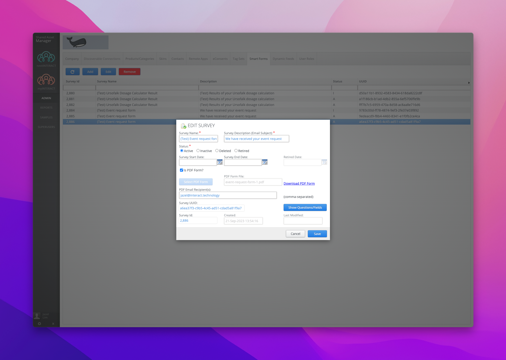
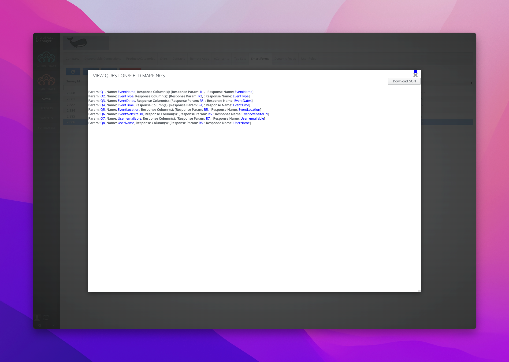

# MyInteract Smart Forms

<sub>(as of September 2023)</sub>

MyInteract uses smart forms to collate form submissions (eg. registration forms, surveys, voting polls) or send out custom forms (such as calculation results, quiz results). Smart forms are used in assets, which are then uploaded to SAM to be used by any myInteract user who has access to that asset.

## Setting up

Before you can start on anything, make sure you have access to the following:

- Test SAM access
- Mockup design of the asset
- PDF design (if there's any)
- The important bit is too know which data you'll be using for the smart form

## How it works

Using itSam, you can pass the form field values from an asset to the smart form. The data will then be automatically transferred to a PDF, then a copy will be sent to the set recipient (usually the company who owns the asset or an MI admin), the MI user or both.

## Building

Do your thing and build the asset and make sure that you can render all required data to be used for the smart form. The form data does not have to match the fields for the smart form at this point. As long as the code is readable and functioning properly.

Later, a composable will be introduced which will make the transfer of the form data to the smart form a bit easier.

## Uploading the Smart Form

Before we can do anything with the smart form fields, the PDF design (with fillable fields, [(important) see how to properly name smart form fields here](#naming-smart-form-fields)) should be uploaded in SAM.

- Upload the PDF in SAM with the company of your choice.

  

- After uploading the PDF, you should be able to click the 'Show Questions/Fields'

  

- Download the JSON file as we will be using that later for generating the payload required for the smart form.

## Piecing things together

Now that we have the _form data_ and the _smart form fields_, we can now combine the pieces together. We'll have to read SAM Web API docs, specifically the **_postSurveyResults_** under the Smartform API. (Please ask Aaron for the access to the API sheet, everything you might need is in there.)

> "Submits Smart Form responses to SAM.
> NOTE: For legacy these are called Surveys/Forms as they used to hanfle Surveys/Quizzes but only support PDF Forms now.
> 16-OCT-17 - V3 now supports a total of 320 fields - 300 Text, 20 Images."

TLDR: This will handle the data we're submitting and be transferred to the PDF we uploaded in SAM.

### Path

For the axios request – ***(itSam.baseUrl)/rest/survey/results***

### HTTP Request Params/Object

The general structure of the object that should be submitted to the API. This seems a lot of work if you will manually match the fields, so I did a [composable](#tosmartformpayload-composable) which can be reused regardless of how many fields are in the smart form.

**An array of responses**

- **NOTE:** "R" denotes a Text Response whilst "I" denotes and Image Response.
- **NOTE:** All images should be sent as BASE64 text representations.
- **NOTE:** for "version" >= 2 clients MUST provide "clientFormUUID" values. If no "version" provided then it defaults to V1 and no "clientFormUUID" values are required.
- **NOTE:** Version 3 added 100 new text fields and was bumped just so we can differentiate the change. However, passing 300 text fields with v1 or v2 will still work.

```
{ "resultset" :
     [ { "Q1" : { "R1" : "true" },
        "Q2" : { "R2" : "true",
            "R3" : "false",
            "R4" : "true",
            "R5" : "false"
          },
        "clientFormUUID" : "ClientFormUUID365",
        "submitted" : 1445402419921
      },
      { "Q1" : { "R1" : "true" },
        "Q2" : { "R2" : "false",
            "R3" : "false",
            "R4" : "false",
            "R5" : "true"
          },
        "clientFormUUID" : "ClientFormUUID366",
        "submitted" : 1445402419921
      }
    ],
  "surveyId" : 1,
  "version" : 2
}"
```

### An example

Here is an example of all the data you will need for the API. The format of the **resultForm** is important if you're going to use the composable that I made that will translate it to the "resultset" format required for the request. If you have your own method of doing it, then you can skip these.

```
const completedForm = props.form
const calculatedResult = props.result
const timestamp = Date.now()
const sessionId = uuidv4()
const formId = 2882
const deviceTypeStore = useDeviceTypeStore()
const userStore = useUserStore()

let filteredDosageAdministrationList = computed(() => {
  return completedForm.disease.name.includes('CF')
    ? dosageAdministrationList.filter((listItem, index) => index < 2)
    : dosageAdministrationList
})

const resultForm = {
  DiseaseName: completedForm.disease.name,
  CalculationResultDosageLabel: calculatedResult.dosage_label,
  ProductDose: completedForm.product.dose,
  CalculationResultDosage: calculatedResult.dosage,
  UrsofalkProductImage: completedForm.product.image_url,
  AdministrationListItem1: filteredDosageAdministrationList.value[0].description,
  AdministrationListItem2: filteredDosageAdministrationList.value[1].description,
  AdministrationListItem3: filteredDosageAdministrationList.value[2]
    ? filteredDosageAdministrationList.value[2].description
    : '',
  ListItemBulletImage1: BulletIcon,
  ListItemBulletImage2: BulletIcon,
  ListItemBulletImage3: filteredDosageAdministrationList.value[2] ? BulletIcon : '',
  User_emailable: userStore.user.email
}
```

### toSmartFormPayload composable

This will return the object required for the API request. You can see how it's used on the sample submit function below.
Where the:

- id - is the form id generated from SAM upon uploading the PDF
- form - is the resultForm object as the example above
- timestamp - is the time in EPOCH format
- session - a generated UUID
- schema - the smart-form-fields.json that is downloaded from SAM

```
export function toSmartFormPayload(id, form, timestamp, session, schema) {
  return {
    surveyId: id,
    version: 3,
    resultset: [
      {
        submitted: timestamp,
        clientFormUUID: session,
        ...Object.fromEntries(
          Object.entries(form).map(([key, value]) => {
            const field = schema.fieldMappings.find(({ fieldName }) => fieldName === key)

            return [
              field.qCol,
              {
                [field.rCol]: value
              }
            ]
          })
        )
      }
    ]
  }
}

```

### Sample function that submits the smart form

```
function sendResultToUserEmail() {
  const toPDF = toSmartFormPayload(formId, resultForm, timestamp, sessionId, schema)

  axios
    .post(`/rest/survey/results`, toPDF, {
      headers: { 'Content-Type': 'application/json' }
    })
    .then(() => {
      sentToEmailDialogisToggled.value = true
    })
    .catch(() => {
      errorMessage.value =
        'Something went wrong while sending the result. Please try again in a few minutes.'

      nextTick(() => error.value?.scrollIntoView({ behavior: 'smooth', block: 'center' }))
      setTimeout(() => {
        errorMessage.value = ''
      }, 8000)
    })
}
```

Upon submitting the form, the set recipient in SAM should receive a copy of the PDF result and if "User_Emailable" is set in the PDF fields, a copy should also be sent to the user who filled out the form.

## Naming smart form fields

<sub>(These are all grabbed from the previous wiki, then modified.)</sub>

### Best Practices

1.  After SAM release on May 8, 2016: rather than setting a form INACTIVE, set the form to RETIRED. This state is like a 'soft' inactive, meaning, SmartForm submissions can be still submitted. In the table this state will be displayed with the letter 'R'

2.  The fields/IDs in the PDF form must be unique and should be PascalCase and as expressive as possible. However, it should only contain alphabetical characters (a-z, A-Z, no space, dash or underscore, with exceptions to this rule lined out below.)

    **Example Fields**

    ```
    ThisIsASmartFormFieldExample
    ThisIsASmartFormFieldExample9000
    This_Is_A_Smart_Form_Field_Example
    This-Is-A-Smart-Form-Field-Example2
    This_Is_A_Smart_Form_Field_Example100

    ```

### **Reserved fields**

> _**These are important, please take not of this when building the fields.**_

> > **SmartFormUniqueID** - this is used to generate a unique ID (across all SmartForms)

> > **Text_Emailable** - allows the email from this field to receive a copy of the PDF

> > **Text_Image** - allows this field to be treated as an image, e.g. for signatures

> "Text" can be replaced by any name, just make sure to keep \_Emailable or \_Image so that the smart form recognizes the field type. An image field won't be recognized without the keyword "image".

- **How to name radio buttons and checkboxes**

  - Text_RadioValue
  - Text_CheckboxValue
  - e.g. Received_No, Received_Yes

3. Do not collect credit card information due to the need for PCI compliance

4. It's good to know that SmartForms also work on MI Desktop, including the ability to take a signature.

5. All SmartForms should

   i. do field validation that the max length of any fields should not exceed 1500 characters (with the exception of signature/images fields).

   ii. In case the form doesn't submit the error code from the server display the error message (when/if provided)

<sub>SmartPDF creation: Currently SmartForms can only be created by INTERACT agency.</sub>
